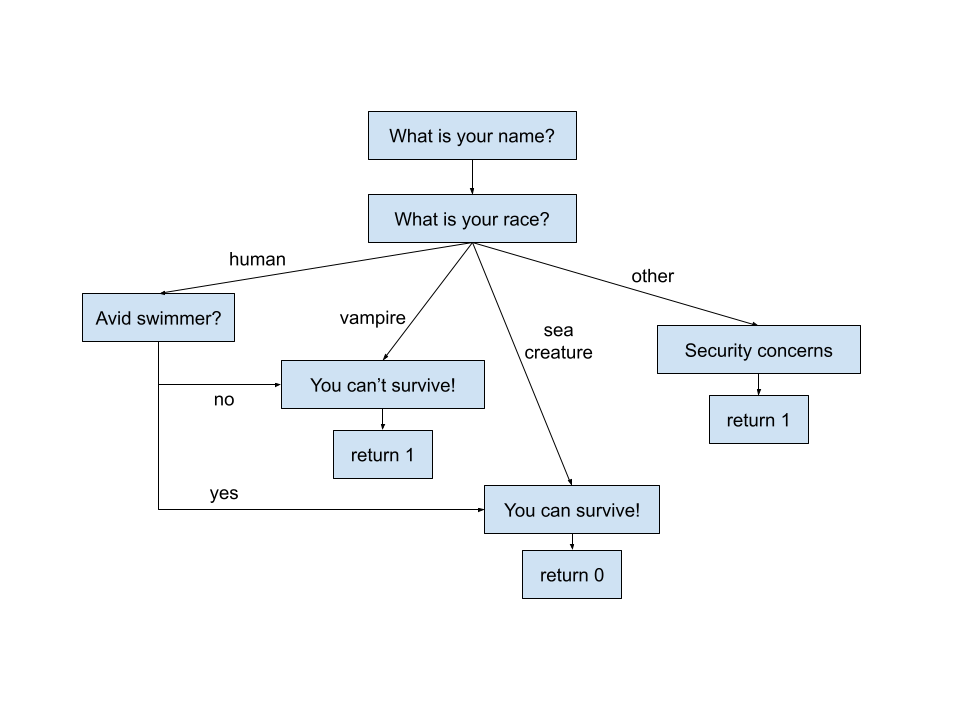
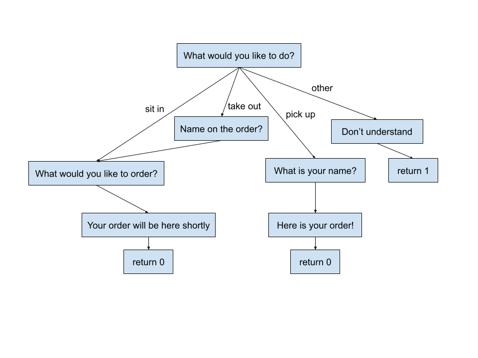

# Project 1: Choose Your Own Adventure

In this project, you will learn how to:
- use nested conditionals
- write your own program from scratch
- [Optional] collaborate with someone directly on code

## Part 1: Flowchart

We have learned in class how to model decisions using a flowchart. For this project, you'll need to create your own flowchart that satisfies the following criteria:

- Have at least 5 possible endings.
- Have at least one decision node with 3 or more options to proceed.
- Have at least one node that's reachable from 2 or more paths.

You can create your own flowchart using https://docs.google.com/drawings/ or any other method you prefer. You will need to submit either a `.png` or a Google Drawings link to Gradescope.

Here are two samples you can refer to when working through your project. Note that these do not satisfy all the above criteria - they are simply there to help you get started.

**Sample adventure** ([Google Drawings link](https://docs.google.com/drawings/d/1HKa4MWe0gFh6JeeFcHoGQSKRLMbzmcV725Td8HmHp4c/edit?usp=sharing))

One direction you can pursue is the classic [Choose Your Own Adventure](https://en.wikipedia.org/wiki/Choose_Your_Own_Adventure) genre. For those of you who are familiar and motivated, you can even write your own [Dungeons & Dragons](https://en.wikipedia.org/wiki/Dungeons_%26_Dragons) program! Come up with a fantasy world and guide your users through it with a series of questions and challenges.

**Sample restaurant** ([Google Drawings link](https://docs.google.com/drawings/d/1P2smcTL2KJcQoFHr6bNKyah22G8hz8R9ssqpA3sgKNw/edit?usp=sharing))

A perhaps more relatable option would be to continue what we started in previous labs and write your own customer service bot. Invent your own restaurant, bar, theme park, movie theatre, or anything that inspires you! Give it a catchy name and attractive setting, then offer your users the service they deserve.

When coming up with your story, keep in mind the following technical requirements that your code will be subject to in part 2:

- Use at least 2 of the [arithmetic operators](https://docs.google.com/document/d/1FPvQm1-t6c4NbYWEjOI-4mOxYMv5ipKewEMiIT1NwNk/edit#heading=h.hnjugv14fd6k) we learned in class.
  - Eg. calculating item price, taxes, health points, damage, levels.
- Use at least 2 of the [string manipulation](https://docs.google.com/document/d/1FPvQm1-t6c4NbYWEjOI-4mOxYMv5ipKewEMiIT1NwNk/edit#heading=h.dg0v23h13i2g) methods we learned in class.
  - Eg. modifying player titles, assigning customer orders.
- Use at least 2 of the [comparison operators](https://docs.google.com/document/d/1FPvQm1-t6c4NbYWEjOI-4mOxYMv5ipKewEMiIT1NwNk/edit#heading=h.logb7lo48xxs) we learned in class.
  - Eg. checking for cheat codes, user preferences.

Submit your `.png` or Google Drawings link to `Project 1 - Part 1: Flowchart` on Gradescope.

### Due Date

- Section A: September 21, 11:59pm
- Section B: September 23, 11:59pm

See [bit.ly/hwei-cs120-info](https://bit.ly/hwei-cs120-info) for all due dates.

## Part 2: Programming

Convert your flowchart from part 1 into code in `cyoa.cpp`. You can look at `demo/adventure.cpp` and `demo/restaurant.cpp` for an idea on how this can be done.

Technical requirements:

- Use at least 2 of the [arithmetic operators](https://docs.google.com/document/d/1FPvQm1-t6c4NbYWEjOI-4mOxYMv5ipKewEMiIT1NwNk/edit#heading=h.hnjugv14fd6k) we learned in class.
  - Eg. calculating item price, taxes, health points, damage, levels.
- Use at least 2 of the [string manipulation](https://docs.google.com/document/d/1FPvQm1-t6c4NbYWEjOI-4mOxYMv5ipKewEMiIT1NwNk/edit#heading=h.dg0v23h13i2g) methods we learned in class.
  - Eg. modifying player titles, assigning customer orders.
- Use at least 2 of the [comparison operators](https://docs.google.com/document/d/1FPvQm1-t6c4NbYWEjOI-4mOxYMv5ipKewEMiIT1NwNk/edit#heading=h.logb7lo48xxs) we learned in class.
  - Eg. checking for cheat codes, user preferences.

If you made any logical changes, don't forget to update your flowchart from part 1!

Submit your code to `Project 1 - Part 2: Programming` and your up-to-date flowchart to `Project 1 - Part 2: Flowchart` on Gradescope.

### Due Date

- Section A: October 5, 11:59pm
- Section B: October 7, 11:59pm

See [bit.ly/hwei-cs120-info](https://bit.ly/hwei-cs120-info) for all due dates.

## Rubric

* (30 points + 5 bonus points) Part 1: Flowchart
    * (5 points) 5+ possible endings
    * (5 points) 3+ options from some node
    * (5 points) 2+ paths to the same node
    * (10 points) Flowchart quality
    * (10 points) Flowchart creativity
* (10 points) Part 2: Flowchart
    * (10 points) Flowchart matches code logic
* (60 points + 5 bonus points) Part 2: Programming
    * (5 points) 5+ possible endings
    * (5 points) 3+ options from some node
    * (5 points) 2+ paths to the same node
    * (3 points) Code compiles
    * (1 point) Name(s) inscribed
    * (1 point) No TODO comments
    * (5 points) Code passes style checks
    * (5 points) 2+ arithmetic operators
    * (5 points) 2+ string manipulation methods
    * (5 points) 2+ comparison operators
    * (10 points) Code quality
    * (15 points) Code creativity
